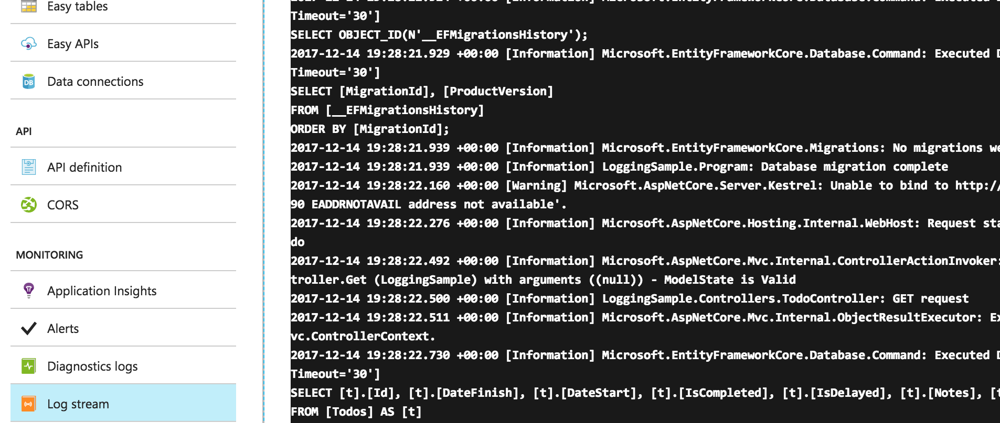

## Logging in ASP.NET Core

This sample shows how to use different built-in logging providers depending on environment.
_Full list of covered issues_:
* log category
* log level
* filter rules
* providers
* log scope
* how to read your NetCore App logs on Azure

### How to read .NetCore app logs on Azure
Before you need to configure Azure log streaming. Turn on application logging (Filesystem) on the diagnostics logs page from your application's Azure console. Then navigate to the Log Streaming page to view application messages.

### Sumup: My "must have" list for every .Net Core App.
1. You have to decide where your app will be hosted thus you can choose right logging providers and the way you'll be working with logs. My choise for this app: Debug and Azure.
2. You have to decide which log levels you'll be using in your code, where and why. My choise for this app: Information, Warning and Exception
3. It's usefull to have different environment specific configurations: Develeopment, Testing, Production. For some loggers we can use config files. __Warning__: It's usefull only for those providers that support it. IncludeScopes works for console logger but via appsettings configuration files is a feature that's planned for the ASP.NET Core 2.1 release.
4. To change log level without app publishing we can use filtering in config files. _Warning_: only for supported providers, like debug, console, for azure it works from azure console. My choise for this app: Warning.

### Links
1. [High-performance logging with LoggerMessage](https://docs.microsoft.com/en-us/aspnet/core/fundamentals/logging/loggermessage)
2. [Introduction to Logging in ASP.NET Core](https://docs.microsoft.com/en-us/aspnet/core/fundamentals/logging/?tabs=aspnetcore2x)
3. [Where to Find Azure App Service Logs for Your App, IIS, Failed Request Tracing, etc](https://stackify.com/azure-app-service-log-files/)